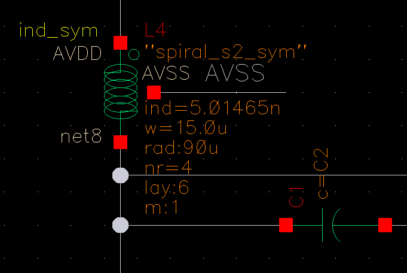

# [踩坑] 解决 TSMC18RF 仿真 ind_sym 电感报错：Undefined model 'spiral_s2_sym' (ERROR SFE-23)

> **摘要**：在 Cadence IC618 环境下使用 TSMC 180nm RF (tsmc18rf) 工艺库进行电路仿真时，实际电感 `ind_sym` 导致仿真器报错 `ERROR (SFE-23)`。本文记录了该问题的成因及修改 Model Library Setup 的解决方法。

## 1. 问题描述 (Problem Description)

在设计射频电路（如 LNA、VCO）时，使用了工艺库中的实际对称电感 **`ind_sym`**。但在运行 Spectre 仿真时，电路读入阶段（Circuit read-in）发生中断，报错信息如下：

```text
Error found by spectre during circuit read-in.
ERROR (SFE-23): "input.scs" 60: The instance L4' is referencing an undefined model or subcircuit, spiral_s2_sym'. Either include the file containing the definition of spiral_s2_sym', or define spiral_s2_sym' before running the simulation.

### 解决过程 (Debug Process)

经过资料查询，发现报错 `SFE-23` 是因为在 **Model Library Setup** 里找不到 `ind_sym` 这个实际电感的路径。以下是具体解决步骤：



1.  **检查当前模型配置**
    在仿真界面下打开 **Model Library Setup**。
    * 观察发现，当前 Section 名为 `tt_rfind` 的文件引用的是 `cro18gpii_v1d0.scs`。
    * **问题点**：这个 `cro18gpii_v1d0.scs` 文件里并没有包含实际电感 `ind_sym` 的定义。

2.  **添加正确的模型文件**
    在界面最下方点击 **Click here to add model file**，重新加入包含实际电感的文件。
    * **文件路径**：`tsmc18rf` --> `models` --> `spectre` --> `rf018.scs`
    * **说明**：这个 `rf018.scs` 才是包含了实际电感定义的文件。

3.  **设置 Section 名称**
    把新添加路径的 Section 名称填写为 `tt_rfind`。
    * *注：这个名称是在 `rf018.scs` 文件里对应的实际电感的 Section 名称。*

4.  **解决冲突并验证**
    此时如果直接点 OK 会报错，因为新添加的 `tt_rfind` 与上面原有的 `cro18gpii_v1d0.scs` 的 Section 名冲突了。
    * **解决方法**：将 `cro18gpii_v1d0.scs` 前面的勾选框**取消 (Uncheck)** 即可。
    * **结果**：重新运行仿真，报错消失，仿真成功。
